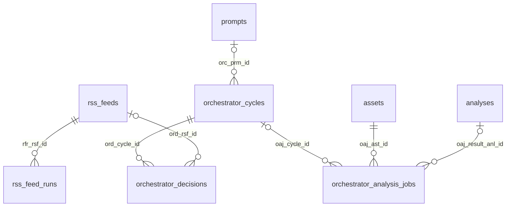

# Orchestrator decision history

The change adds **two tables** (`orchestrator_cycles`, `orchestrator_decisions`)
and **one nullable foreign-key column** (`orchestrator_analysis_jobs.oaj_cycle_id`).
There is no new relationship to users or portfolios: the orchestrator supervises
market research and RSS scheduling across the application.

## Diagram for the database model

These lines represent real database foreign keys. `o|` means an optional parent,
`||` means a required parent, and `o{` means zero or more children.



| Child column | Parent key | Meaning | If the parent is deleted |
| --- | --- | --- | --- |
| `orchestrator_cycles.orc_prm_id` | `prompts.prm_id` | Prompt used for this cycle; nullable for imported history with no surviving prompt | Set link to NULL; keep cycle |
| `orchestrator_decisions.ord_cycle_id` | `orchestrator_cycles.orc_id` | Required owning cycle; one cycle can have many RSS decisions | Delete its decision rows |
| `orchestrator_decisions.ord_rsf_id` | `rss_feeds.rsf_id` | Target feed; nullable for unknown/rejected targets or deleted feeds | Set link to NULL; preserve proposal snapshot |
| `orchestrator_analysis_jobs.oaj_cycle_id` | `orchestrator_cycles.orc_id` | Cycle that actually created this follow-up job; nullable for older/unlinked jobs | Set link to NULL; keep job |
| `orchestrator_analysis_jobs.oaj_ast_id` | `assets.ast_id` | Required asset researched by the job; existing relationship | Deletion is blocked while referenced |
| `orchestrator_analysis_jobs.oaj_result_anl_id` | `analyses.anl_id` | Analysis produced by a successful job; NULL until a result exists; existing relationship | Set link to NULL; keep job |
| `rss_feed_runs.rfr_rsf_id` | `rss_feeds.rsf_id` | Feed executed by this run; existing relationship | Delete its run rows |

The result-analysis relationship is not unique: the database does not enforce
one job per analysis. The cycle-to-prompt relationship also has no uniqueness
constraint. Draw these as many-to-one relationships rather than one-to-one.

## What each new table contains

`orchestrator_cycles` stores one valid model decision cycle:

- `orc_id`: primary key used by the API and child foreign keys.
- `orc_history_key`: unique source-and-start-time key that prevents a JSON import
  from duplicating a cycle already saved by the live service.
- `orc_source`: `background` or `test`; Swagger test runs are recorded separately
  from background runs and are visible in the same history endpoint.
- `orc_started_at`, `orc_completed_at`, `orc_signal_window_start`: timing.
- `orc_prm_id`, `orc_model`: prompt link and model name.
- `orc_status`, `orc_error`: whether applying the cycle's decisions completed.
- `orc_snapshot` (JSONB): immutable decision content, including situation summary,
  requested follow-up questions, handoff instructions, next-run delay, and signal IDs.
- `orc_raw_model_content`: the original model response text, stored for auditing;
  omitted from the paginated response to keep pages compact.

`orchestrator_decisions` stores one RSS proposal within a cycle:

- `ord_id`: primary key.
- `ord_cycle_id`, `ord_position`: parent cycle and proposal order; this pair is unique.
- `ord_rsf_id`: optional feed foreign key.
- `ord_proposal` (JSONB): action, target name, parameters, reason, confidence.
- `ord_approved`: NULL before evaluation, then true or false.
- `ord_status`, `ord_rejection_reason`, `ord_error`: policy/application outcome.
- `ord_instruction_id`: unique instruction identifier for approved actions.

A cycle with no RSS proposals still has a cycle row and can request follow-ups
or decide to wait. A follow-up request is retained in the snapshot even when no
job is created because an active job, duplicate question, or unknown asset caused
it to be skipped. Only newly created jobs receive the cycle foreign key.

## Logical references that are not foreign keys

Do **not** draw a foreign-key edge from `orchestrator_cycles` to `signals`.
`orc_snapshot.signal_ids` is a historical array, not a relational link. Deleting
or modifying a signal does not rewrite the recorded decision.

`ord_proposal.target` also preserves the feed name independently of the feed FK.
The snapshot remains readable when a feed is deleted or renamed.

`orchestrator_decisions.ord_instruction_id` can be compared with the existing
`rss_feed_runs.rfr_instruction_id` and `rss_feeds.rsf_pending_instruction_id`.
These are logical string references, **not foreign keys**. An RSS scheduling
change does not necessarily create a run immediately; ordinary scheduled runs
may have no instruction ID. `applied` means the scheduling change was persisted,
not that an RSS run has succeeded. Actual run results remain in `rss_feed_runs`.

## Status meanings and write flow

1. The model returns a valid decision. The cycle and all RSS proposals are saved
   before any requested jobs or schedule changes are applied.
2. New follow-up jobs are inserted with `oaj_cycle_id` in the same transaction as
   the job itself. Their existing execution lifecycle is unchanged.
3. Each RSS proposal is evaluated: `pending` -> `rejected`, or `pending` ->
   `approved` -> `applied`/`failed`. Rejections include the policy reason; application
   failures include the error. `approved` alone is not proof of successful application.
4. The cycle becomes `completed` when its requests and schedule changes have been
   handled, or `failed` when applying them raises an error. A completed cycle may
   contain rejected proposals. Its follow-up jobs can still be pending or running.

The history commits surround existing job/schedule transactions. They are not
one transaction for the entire cycle: earlier successful changes can remain
applied when a later action fails. A process termination can leave a cycle
`applying` or a proposal `approved`; these states indicate an incomplete audit,
not a confirmed success. Model/network failures before a valid decision exists
retain the existing prompt audit but do not create a decision-history cycle.

## Endpoint

`GET /api/orchestrator/decisions?page=1&page_size=20`

```json
{
  "count": 123,
  "page": 1,
  "page_size": 20,
  "items": []
}
```

`count` is the total number of stored cycles. Results sort by cycle start time
and cycle ID descending. Page numbering starts at 1; page size defaults to 20
and accepts 1–100. An out-of-range page returns an empty `items` list with the
same total count. Validation errors return HTTP 422.

Each item includes cycle ID/source/time/status, summary, signal IDs, requested
follow-ups, handoff, next-run delay/time, RSS proposals with their policy and
application outcomes, and the current state of the jobs created by this cycle.
`next_run_at` is the cycle's planned next time, not a guarantee about when the
service actually ran. `history_complete` distinguishes complete new decision
records from partial legacy imports. Job status is live; decision content is
historical. Pagination applies to cycles, not individual RSS proposals.

## Migration and retained JSON history

For an existing database, apply this after the previous RSS and analysis-job
migrations, before starting the updated application:

```bash
psql -v ON_ERROR_STOP=1 -f migrations/20261006_create_orchestrator_history.sql
```

The fresh-database definitions are also included in `faah_postgres_schema.sql`.
Use the incremental migration for an existing database; the full schema script
contains DROP statements.

Retained JSON cycles are imported automatically before each decision cycle,
without repeating actions. To import immediately without invoking the model,
run these with the same database environment as the application:

```bash
python -m orchestrator_agent.import_history
python -m orchestrator_agent.import_history --source test --memory-path data/orchestrator_swagger_memory.json
```

The background command respects `ORCHESTRATOR_MEMORY_PATH`; `--memory-path`
can override it. Imports are idempotent. Existing job IDs are linked back to
imported cycles when they are still present and have no cycle link. Missing
prompt IDs are left NULL.

Imported cycles have status `legacy` and `history_complete=false`. Surviving
approved decisions are matched only through their exact instruction IDs and
have status `legacy_approved`: their actual application result is unknown.
Legacy rejected counts are preserved, but their individual rejection records
cannot reliably be associated with cycles because the old records had no cycle
ID. No association is guessed. Entries already removed by the old 50-cycle/
200-decision JSON retention cannot be recovered from that file.

JSON memory remains the compact runtime cursor and model handoff. Its retention
limits do not truncate PostgreSQL history. Resetting Swagger memory does not
remove archived database history.
